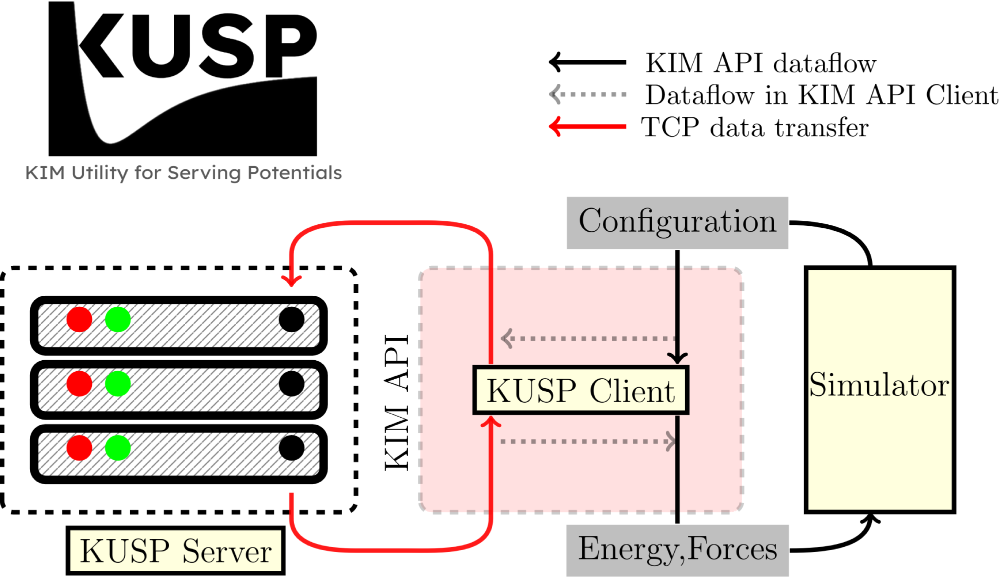
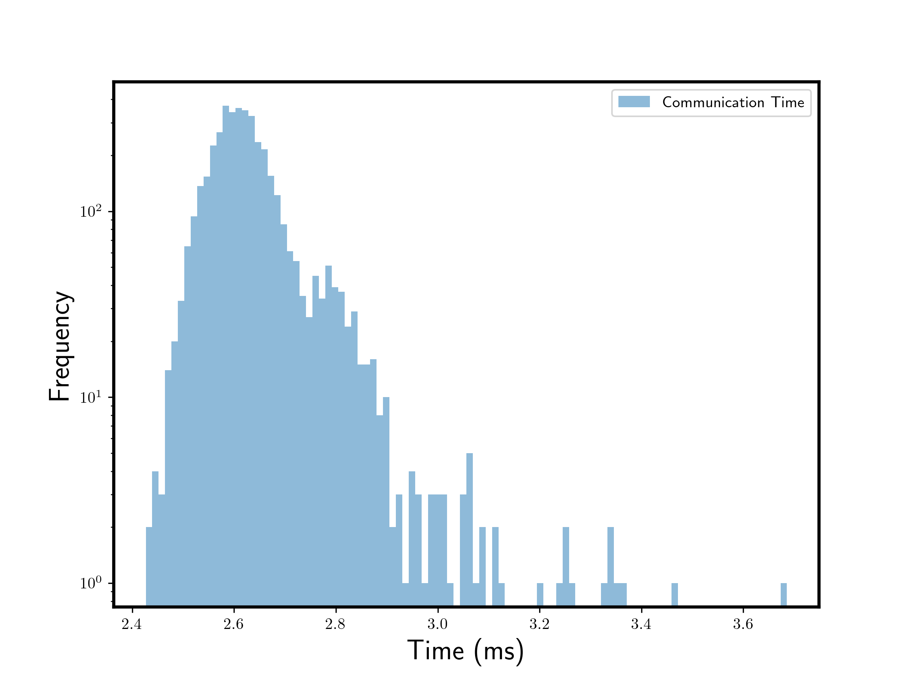

KUSP: KIM Utility for Serving Potentials
=========================================
[](https://kusp.readthedocs.io/en/latest/?badge=latest)


This utility package provides an easy and quick way to deploy any potential, ML
or otherwise to the KIM API. It is designed to be used as a quick prototyping and benchmarking
tool against OpenKIM tests and verification checks.
This ensures that any valid ML model is on equal footing with OpenKIM supported interatomic
potentials, and can directly guide uses in improving their models or datasets etc.

> Please note that KUSP is supplementary tool for model validation and development,
> and for high performance production runs, you are advised to use the KIM model drivers.

## Installation
> `pip install kusp`

## Difference between KUSP and TorchML model driver
KUSP used Python interpreter to run any ML model in its native environment, and then
converts the output to KIM API compatible format. KIM API communicates with the model using
the KUSP Python server, which uses sockets to communicate.



While this is easy and quick, it is  not the most efficient way to run ML models. Besides
the overhead of Python interpreter, you also have the communication overhead between
Python and C++ code, and overhead of the data transfer process, which is usually 100-400ms
per call. This is not a problem for very large models, but for small models, this overhead
can be significant.



Also, KUSP is not designed to be portable from user to user, while with KIM API
you can install any model as simply as `kim-api-collections-management install user <model>`.
Hence, while KUSP is good for prototyping, users are encouraged to covert their models
to KIM API compatible models, and use the KIM model drivers for production runs.

## KUSP Protocol
KUSP uses a simple protocol to communicate with the KIM API. The protocol expects the
configuration information in following order,

```plaintext
    [Necessary] First 4 bytes: size of integer on the system (int_width), 32 bit integer
    [Necessary] Next int_width bytes: number of atoms (n_atoms), default int_width integer
    [Necessary] Next int_width x n_atoms bytes: atomic numbers
    [Necessary] Next 8 x 3 x n_atoms bytes: positions of atoms (x, y, z), double precision
    [Optional] Next int_width x n_atoms bytes: Which atoms to compute energy for (contributing atoms)
```

## Dependencies
KUSP is a minimal dependency package, but it requires KIM API to serve potentials in simulator
agnostic framework. Without KIM API user would need to implement own simulator interface.
To install KIM API, just use the `conda` package manager,

```bash
conda install -c conda-forge kim-api=2.3
```

## Environment Variables
To tell the KUSP KIM API client where to find the KUSP server, you need to set the
environment variable `KUSP_SERVER_CONFIG` to the path of the configuration file.

```bash
export KUSP_SERVER_CONFIG=/path/to/kusp_server_config.yaml
```

## Command-line interface
The `kusp` executable exposes every workflow that the package automates:

- `kusp install {model|driver}` installs the bundled portable Python model (`KUSP__MO_...`) or
  the companion native KIM driver (`KUSP__MD_...`) into the selected KIM collection.
- `kusp remove {model|driver}` removes those artifacts.
- `kusp serve <model.py>` starts the hot-reload capable TCP server. Pressing `Ctrl+C` once reloads
  the Python file from disk, pressing it twice within two seconds shuts the server down.
- `kusp deploy <model.py>` materializes a new portable model directory that contains the decorated
  Python module, any resource files, an environment description, and a ready-to-build CMake project.

All commands honor `-v`/`-vv` for logging just like the Python API.

## Rapid Lennard-Jones prototyping example
The `example/lennard_jones` directory demonstrates the complete workflow:

1. **Write a decorated model**: `example/lennard_jones/lj.py` uses `@kusp_model` to expose a pure
   Python Lennard-Jones potential. The `test_lj.py` script shows how to exercise it through ASE.
2. **Install the shim artifacts**:
   ```bash
   kusp install model
   kusp install driver
   ```
   These commands register `KUSP__MO_000000000000_000` and `KUSP__MD_000000000000_000` inside the
   selected KIM collections so that simulators such as LAMMPS can discover them.
3. **Serve with hot reload**:
   ```bash
   kusp serve example/lennard_jones/lj.py --kusp-config example/kusp_config.yaml
   ```
   Keep this terminal open while developing. Edit `lj.py`, save, and press `Ctrl+C` once to reload
   without disconnecting clients; press `Ctrl+C` twice quickly to stop the server.
4. **Test from C++ simulators**: In another terminal export the config path
   (`export KUSP_CONFIG=$PWD/example/kusp_config.yaml`) and run LAMMPS with the provided input deck
   (`cd example/lennard_jones && lmp -in lmp_lj.in`). The driver in
   `kusp/KUSP__MD_000000000000_000/` forwards requests to the TCP server so you get immediate
   feedback from a real simulator.
5. **Package for re-use**:
   ```bash
   kusp deploy example/lennard_jones/lj.py -n KUSP_lj__MO_111111111111_000
   ```
   The command copies the hashed Python module, optional resources, environment description, and a
   `CMakeLists.txt` into `example/lennard_jones/KUSP_lj__MO_111111111111_000`, ready for
   `kim-api-collections-management install`.

This loop lets you iterate on potentials in pure Python while keeping interoperability with
existing KIM tooling and C++ simulators.

## Citation
If you use KUSP in your research, or find it useful, please cite the following paper, [accessible here](https://openreview.net/forum?id=lQAnpCF7nq).

```bibtex
@inproceedings{gupta2024kusp,
  title={KUSP: Python server for deploying ML interatomic potentials},
  author={Gupta, Amit and Tadmor, Ellad B and Martiniani, Stefano},
  booktitle={AI for Accelerated Materials Design-Vienna 2024}
}
```
