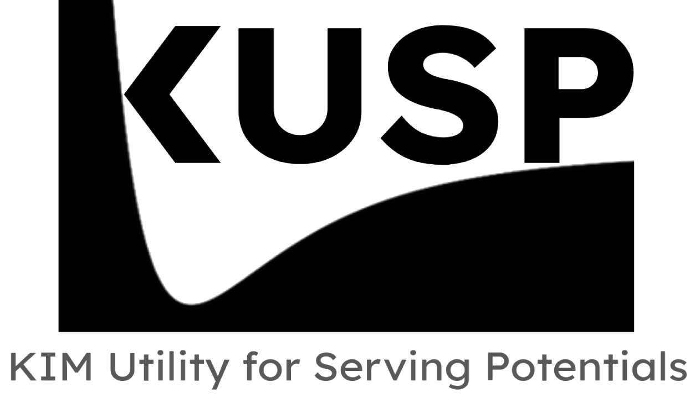
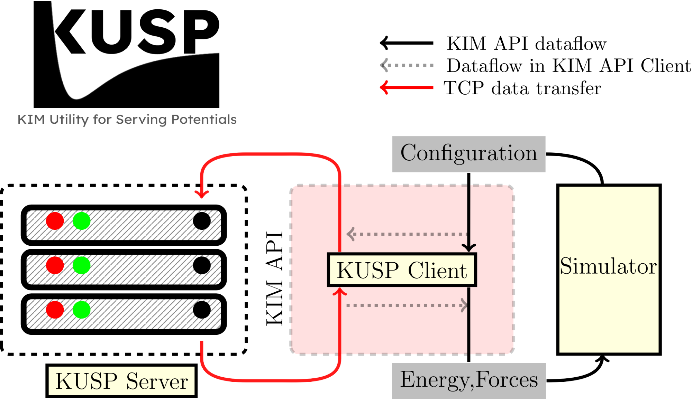
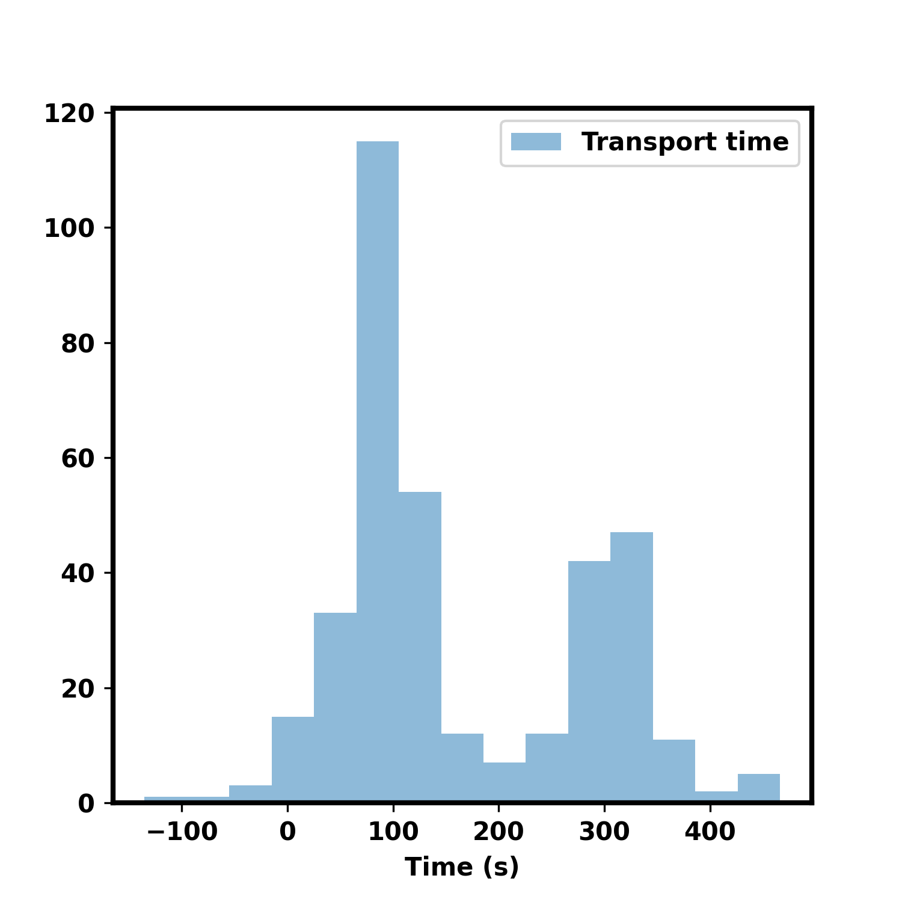

KUSP 2.0: KIM Utility for Serving Potentials
============================================
[](https://kusp.readthedocs.io/en/latest/?badge=latest)



KUSP was developed to provide an easy and quick way to deploy any potential, ML
or otherwise to the KIM API. 
It ensured that any valid ML model was on equal footing with OpenKIM supported interatomic
potentials, and could directly guide uses in improving their models or datasets etc.

With the latest 2.0 release kusp has become even easier to use, with more powerful features 
to run your models with almost any simulator. With new capabilities, like hot-reloading of
models at runtime, kusp is also a powerful prototyping system which is truly independent
of any simulator.

Another added benefit of KUSP 2.0 is the included KUSP KIM-API model driver. Using it you
can port **any** python callable object as a full KIM-API model. It achieves this  by using
the Python C++ API and Pybind11, faithfully recreating the exact python env at runtime, 
from with in the KIM-API ecosystem.

> Please note that KUSP is primarily designed for model validation and development,
> and for high performance production runs, you are advised to use the KIM model drivers.

## Difference between KUSP and TorchML model driver
KUSP uses the Python interpreter to run any model in its native environment. KIM API 
communicates with the model using the `sockets` interface in `serve` mode,  and direct 
foreign function interface (via Pybind11) in the `export` mode.



While this is easy and quick, it is  not the most efficient way to run ML models. Besides
the overhead of Python interpreter, you also have the communication overhead between
Python and C++ code, and overhead of the data transfer process, which is usually 100-400ms
per call in the `sockets` interface. This is not a problem for very large models, but for
small models, this overhead can be significant. This is on top of inherent Python performance
limitations.



Addressing the previous limitation, KUSP is now designed to be completely portable. With KIM-API
and all the dependencies installed, you can install any KUSP exported model as simply as 
`kim-api-collections-management install user <model>`.  

## Key capabilities

- **Turnkey CLI** – `kusp install`, `kusp serve`, and `kusp export` cover the full
  lifecycle from registering the bundled portable model and driver artifacts to packaging a new model.
- **Hot reload server** – `kusp serve model.py` hosts a TCP endpoint with `Ctrl+C`-based hot reload,
  so editing the Python source immediately affects subsequent simulator calls.
- **Rapid export** – `kusp export` snapshots your Python model along with resources,
  environment metadata, creating a portable KIM model.

See :doc:`example` for a walk-through that exercises every piece.

## KUSP Protocol
KUSP uses a simple protocol to communicate with the KIM API. The protocol expects the
configuration information in following order,

```text
    [Necessary] First 4 bytes: size of integer on the system (int_width), 32 bit integer
    [Necessary] Next int_width bytes: number of atoms (n_atoms), default int_width integer
    [Necessary] Next int_width x n_atoms bytes: atomic numbers
    [Necessary] Next 8 x 3 x n_atoms bytes: positions of atoms (x, y, z), double precision
    [Optional] Next int_width x n_atoms bytes: Which atoms to compute energy for (contributing atoms)
```

### Callable Signature

## Dependencies
KUSP is a minimal dependency package, but it requires KIM API to serve potentials in simulator
agnostic framework. Without KIM API user would need to implement own simulator interface.

## Environment Variables
|Env. variable| Use                                                                                                                                                                                                                                                                                                                                                                                                       |
|:------------|:----------------------------------------------------------------------------------------------------------------------------------------------------------------------------------------------------------------------------------------------------------------------------------------------------------------------------------------------------------------------------------------------------------|
|`KUSP_CONFIG` | **Runtime** variable for interactive TCP run (`kusp serve` mode). It tells the client about the loaction of the config file containing basic information like influence distance of the model, and server host/port. Config file can be automatically generated by KUSP (name formatted as `kusp_config_{pid}_{timestamp}.yaml`) or can be provided by user as `--kusp-config` flag.                      |
|`KUSP_PYTHON_EXEC`| **Install time** variable to help locate python installation. CMake sometimes struggles to find correct python installation, especially conflating the default system python on Linux installations. You can set the correct python executable to help CMake find it. Please set if env variable becore `kusp install` command if required. See `troubleshooting` section for details on possible issues. |

## Citation
If you use KUSP in your research, or find it useful, please cite the following paper, [accessible here](https://openreview.net/forum?id=lQAnpCF7nq).

```bibtex
@inproceedings{gupta2024kusp,
  title={KUSP: Python server for deploying ML interatomic potentials},
  author={Gupta, Amit and Tadmor, Ellad B and Martiniani, Stefano},
  booktitle={AI for Accelerated Materials Design-Vienna 2024}
}
```
